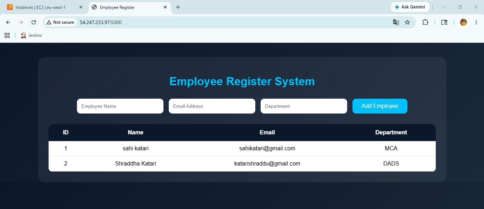
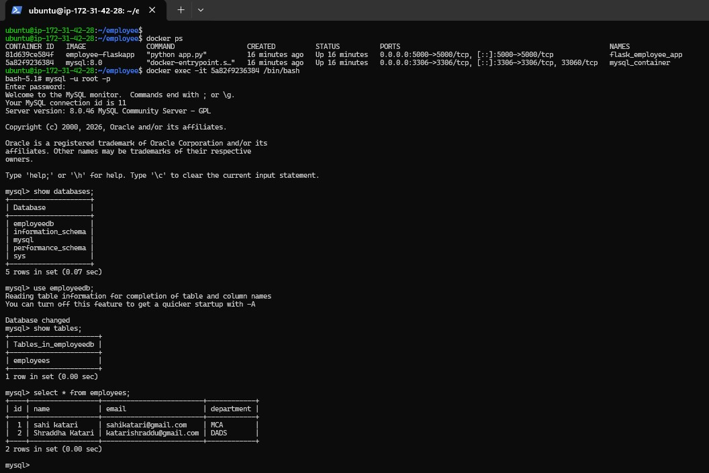
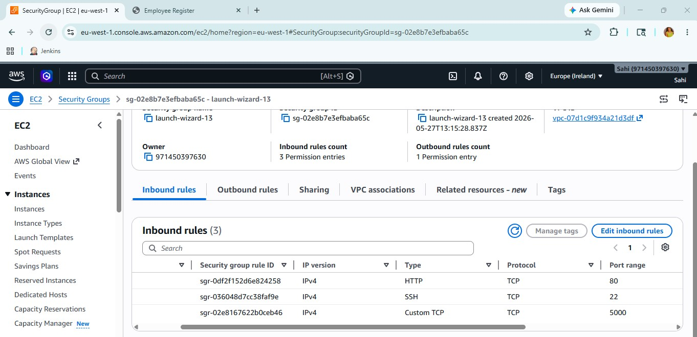

# 🚀 Dockerized Employee Register App

A simple Employee Register Web Application built using Python Flask and MySQL, containerized with Docker and Docker Compose.

---

# 📌 Project Overview

This project demonstrates how to build and deploy a multi-container web application using:

- 🐍 Python Flask
- 🗄️ MySQL
- 🐳 Docker
- ⚙️ Docker Compose

The application allows users to:

✅ Add employee details  
✅ Store data in MySQL database  
✅ View employee records  

---

# 🏗️ Project Architecture

```text
User Browser
      ↓
Flask Application Container
      ↓
MySQL Database Container
```

---

# 📂 Project Structure

```text
employee-register/
│
├── app.py
├── requirements.txt
├── Dockerfile
├── docker-compose.yml
│
├── templates/
│   └── index.html
│
└── static/
    └── style.css
```

---

# 🛠️ Technologies Used

- 🐍 Python
- 🌐 Flask
- 🗄️ MySQL
- 🐳 Docker
- ⚙️ Docker Compose
- 🎨 HTML
- 🎨 CSS

---

# ✨ Features

✅ Employee Registration  
✅ MySQL Database Integration  
✅ Dockerized Deployment  
✅ Multi-Container Architecture  
✅ Responsive User Interface  

---

# 📋 Prerequisites

Make sure the following are installed:

- 🐳 Docker
- ⚙️ Docker Compose

---

# 🚀 Build and Run Containers

```bash
sudo docker compose up --build
```

---

# 🌍 Access Application

## ☁️ AWS EC2

```text
http://<EC2-Public-IP>:5000
```

---

# 🐳 Docker Commands

## 🔍 Check Running Containers

```bash
docker ps
```

## 🛑 Stop Containers

```bash
docker compose down
```

## 🔄 Restart Containers

```bash
docker compose restart
```

---

# 🗄️ MySQL Configuration

Database credentials used in this project:

```text
Host: mysql
User: root
Password: root123
Database: employeedb
```

---

# 🔐 Security Group Settings (AWS EC2)

Open the following ports:

| Port | Purpose |
|------|----------|
| 22   | SSH |
| 5000 | Flask Application |

⚠️ Note:  
You do not need to open port **3306** publicly because MySQL runs internally inside Docker network.

---

# 📚 Skills Learned

✅ Flask Web Development  
✅ Docker Containerization  
✅ Docker Compose  
✅ MySQL Integration  
✅ Multi-Container Applications  
✅ AWS EC2 Deployment  

---
# 📸 Application Screenshots

## 🌐 Home Page



---

## 🗄️ MySQL Database



---

## 🔐 AWS Security Group




